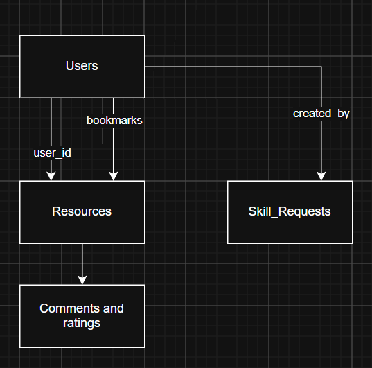

# Project Overview and Stack
This project is the Skill Swap Hub MVP, which I made the front-end for in the first Assignment. The user can create an account, share resourses and interact with posts. The frontend (which was already mostly done) was made with React + TypeScript, and then I used Vite. This was a fast front-end UI.
The backend for the Skill Swap Hub MVP now uses Python Flask to show the endpoints, and MongoDB to make the database. The database stores the users, resources and the requests. Currently, the app runs locally, but it could be changed with a server.
# Choice of Tech Stack
I used React and TypeScript for the frontend because it has easy maintenance and can be locally developed easily.
I used Vite for the local development and performance.
For the backend, I chose flask. It's lightweight and simple for building the APIs.
For the database, I used MongoDB. It makes making iterations easy during making the MVP.
# Project Goals
The project goals for this project were to build a working MVP for the platform, implement authentication, allow users to create and engage with posts.
It should have profiles with management, and should show the relationship between the front and back end.
# Installation Instructions
Clone the repository, run npm install, then run a Python environment and dependencies. Make sure the MongoDB is running on the mongodb://localhost:27017 port, and then run app.py, and npm run dev at the same time.
npm install
py -m venv .venv
pip install flask pymongo werkzeug bson
Then in one powershell tab,
py app.py
And in a seperate tab,
npm run dev
# Basic Legal/Ethical Review
This platform handles personal data like the email and profile details, so it should follow the GDPR principles, those being things like data minimization, secure storage, and clear user consent.
The users cannot upload copyrighted content onto the platform.
The privacy and data handling should be secure to not leak personal information.
# Risk Assessment
There would be a data risk if a weak session protection is there. This risk would be mitigated by password hashing, some validation and some safer configs.
There might be a content risk if any users upload any illegal content.
With scalability, that would possibly be a risk if the performance drops, and it might not be able to handle a big userbase.
# Rationale and Software Attributes
I chose flask because I thought it was the best choice. It is a minimal framework, so you only need add what you actually need. Django is a full stack option, so it already has everything. This isn't good for the file size. Express is quite minimal aswell, but it's around the JavaScript side of things, which wouldn't fit my front-end.
I chose flask because it is fast, it alighns with the brief, it fits with the UI on the front-end, and it has a lot less abstractions than Django, which would be a bit too much for a project on this scale.
# Good software Attributes
I made the React app handle the UI for the front end. It handles the state and the client-side flow. I then made Flask exposes the api routes, and then it returns the JSON for the database. I made that divide between the UI and API, as they are both seperate.
The uploads folder holds all the users uploaded media, so it is in a seperate folder.
Most of the new stuff is in the app.py file. MongoDB is accessed in this file, and it handles all the collection and helper functions. It has a pattern in the file for what it does. It validates the user input, then serialises the call and then returns the call into the JSON.
I was limited by the fact that the database calls could have been moved into their own modules, but instead I did it all inside of the app.py file. This was convenient for me, but would really struggle under a big project.
# Legal and ethics
Concerning GDPR, all of the data processed would fall under GDPR. Things like emails, names, bios, the hobbies and profile images would be under it. I would have to account for the principles of GDPR, like transparency. The users need to know what information is being processed and why it is being collected. This can easily be done with a privacy notice.
Data minimisation is a part of the GDPR. I shouldn't collect anything unnessecary, as this would violate GDPR.
One of the most important parts would be password hashing. The passwords should certainly be kept private and secure.
The users can submit external links and text, so this would create ethical concerns. There could be dangerous links sent, that might lead to viruses or explicit or illegal content. This might require some moderation.
There needs to also be transparency with the community guidelines. The moderation needs to be predictable. Users would need to know why something may get removed.
# Password Hashing
I used a password hash function from Werkzeug. I used generate_password_hash() to protect the passwords. The plain text password is never put into MongoDB. This is required by GDPR by the fact it mentions that you need some type of technical measure to protect the user's data.
# Mitigation and evidence
The uploads use secure_filename and an extension allowlist (png,jpg,gif and webp). This means that it does not accept non-image files, so users cannot inject a bad file into the user uploads. It also has a MAX_CONTENT_LENGTH of around 5mb, so the user cannot just upload terabytes of data onto the server. These measures prevent a malicious user from attacking it through the profile picture uploads.
I did not implement rate limiting though, as that would have been quite time consuming. This would be a solid next step, however.
# Challenges I faced
I faced a very wide variety of issues connecting MongoDB and flask. I faced a lot of issues with the code itself, as that was mainly just me trying to research about how MongoDB works, and how I could use my Python code. I used werkzeug to mitigate a lot of time-wasting on function writing, as importing it helped me strengthen a variety of security-related issues.
Another issue I found was with the IDs. MongoDB uses ObjectID, but the JSON and the react app (which my front end was using) was using strings.
# Entity Relationship Diagram
Below is the ERD for the database

In conclusion, I believe that I have made a back-end that should work on most devices. It holds most of the requirements for a full back-end setup for a skill share website.
# Resources Used
Flask-PyMongo — Flask-PyMongo 2.3.0 documentation. (n.d.). Flask-Pymongo.readthedocs.io. https://flask-pymongo.readthedocs.io/en/latest/

Team, M. D. (2025). Development. Mongodb.com. https://www.mongodb.com/docs/development/
1. Werkzeug Tutorial — Flask API. (2026). Github.io. https://tedboy.github.io/flask/werk_doc.tutorial.html
