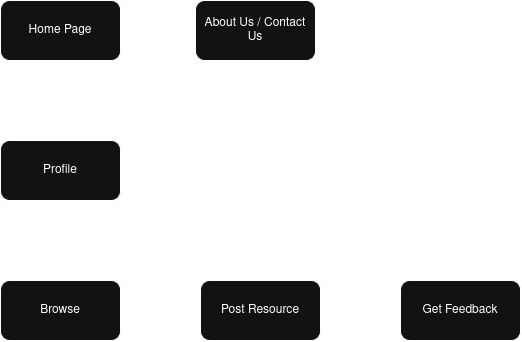

# Choice of tech stack
I have used Type Script and React, using Figma as well. I have chosen TypeScript over JavaScript because it has more capabilities, as well as the fact it works good with Figma. This combination of Tech Stack should be best for a great front-end, and it could work fine with the back-end. It can be maintained easily.
I have used Figma because it is easy to work with and very fast to prototype with. You can also collaborate with other people if trying to create a team to scale up with it. The dependencies for this Tech Stack were TypeScript, React and React Router. I believe all of these were necessary to make the MVP as it best fit the website.

I encountered a couple of errors while creating the project, like a couple of these dependencies not working properly. I needed to import them using the command line.
# Version control
I have used Git for version and I have also used GitHub Classroom for this. I had to create an alternate branch for seperate designs. I did not branch off too often, as I did not need to deploy anything risky.
# Project overview
The goal for this project was to build a Community Skill Swap Hub, where users can share hobbies and resources. My scope is to make a front-end MVP and put mock data onto it, make the user registration UI, allow for posting resources and basic navigation.
# Installation instructions
Clone the github repo, install dependencies and then run the project.
# Project plan
Below is a checklist and a timeline of the work I have been doing.
- [x] 20 November - Basic home page and project setup
- [x] 23 November - Work on CSS and other files
- [x] 26 November - About Us page and Contact Page, main work on the main Skill Share
- [x] 28 November - Feedback from friends on the website
- [x] 2 December - Work on the markdown file
- [x] 4 December - MVP of the page
# User journey 
The user should start off on the home page, then create their profile. Then from there, they can browse the resources on the website. Then they can then post their own resources, and recieve feedback.

# Legal and ethical considerations
This website will be complying with GDPR (the General Data Protection Regulation), as we will we handling data such as names, emails and profile photos.
Any resources on this website will also be the user's owned content, so users cannot upload content that may breach any copyright laws.
Users should follow this when agreeing to the terms of the website.
In terms of ethical consideration, the website will take into account others with impairments like visual colour blindness or blind users. This will be done by using alt text and using colours that may be friendly to users with colour blindness.
We will also remove content that may be harmful or illegal.
There will be colour contrast and some alt text.
# Risk assessment
I will identify risks with the future back end of the site, any UI bugs or missed deadlines. To mitigate these risks, I will code with safety practices in mind, test regularly, and backup the work. I will list any major risks I may encounter.
There was a couple of risks. I will list some below, with impact and how I helped mitigate them.
I came across some UI bugs. This was a medium impact and I fixed these by properly accounting for padding and adjusting the formatting.
I encountered issues with work ethic, and that could be quite high impact. I solved this by getting a proper schedule in place.
# Real-world applications of the platform
This platform can help with community learning and networking. It can help people meet each other on one network that can help align people of similar interests.
# Good Software Attributes
This website is built for scaling and could scale outwards greatly. It can be maintained quite easily as it is quite a lightweight back-end for now, which means it is somewhat secure.

The website uses modules handled by the Node.JS modules. This improves the modularity of the website by making independent modules that can be used in the project.

The website would be easy to maintain as it only requires a host to run. This would be a lot harder to maintain if it had a proper backend implemented.

The website is usable as the user interface and user experience is tailored to be as intuitive as possible. The user path should be relatively straight forward, and anyone should be able to use it.

In terms of scalability, the website can be scaled up pretty well. The website can handle a lot more pages and the backend could be implemented relatively easily.

For security, the website, as of now, has no proper need for it. Security should be a heavy prioritisation for when the backend is fully implemented.
# Future considerations for scaling
Future considerations would be:
* Adding a database
* Using the cloud
* Authentication
* AI recommendations
# How I would do the backend
If I were to actually implement the backend, I would import a couple of modules and packages. I would use something like MongoDB to implement it. I would emphasise work on the security, so no data leaks would happen, however.
# Comparisons
If I had to compare my website to another one with the same premise, like SkillShare, I would say that this website would be certainly be a lot more lightweight and easier to use, but SkillShare has a lot more content. It would take a long time to get anywhere near that amount of content.s
# AI Usage disclosure
CoPilot 365 was used to help format the Markdown file and to assist with what topics to touch on. Figma AI has also assisted me while making the project.
# In-code documentation for key functions and components
I will use comments in the code to make it readable.
There will also be comments in key functions to make it easier to document and look back on when attempting to change or use.
# Reflection
I feel I have done well documenting this website, but I still have some things I believe I could have done better. I could have implemented more things to make the backend easier to do, and I could have brushed up on the UI a lot more. Getting the foundation frameworks decided and built on would have let me work on it a lot earlier.
Overall, the website works well and I feel that the minimum viable product has been produced, and the framework for a proper product might be able to work on this.